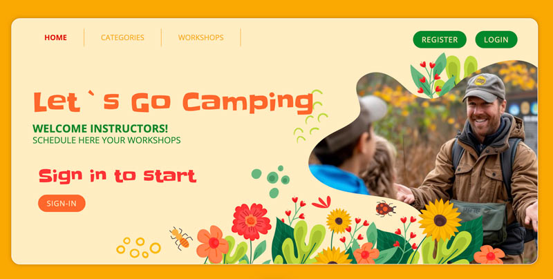
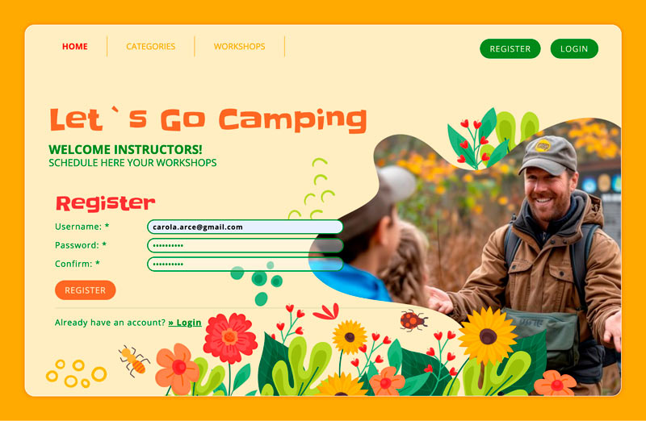
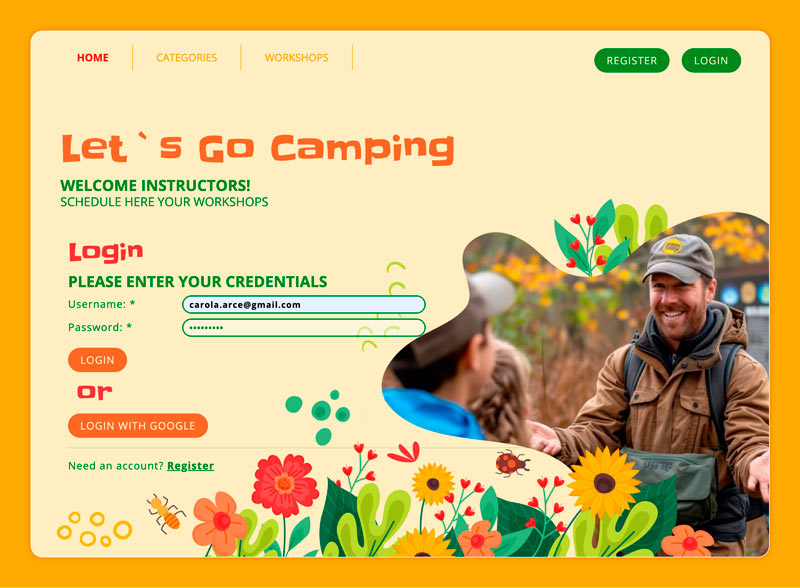
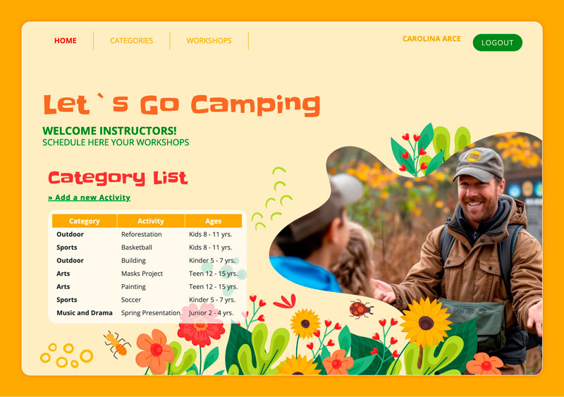
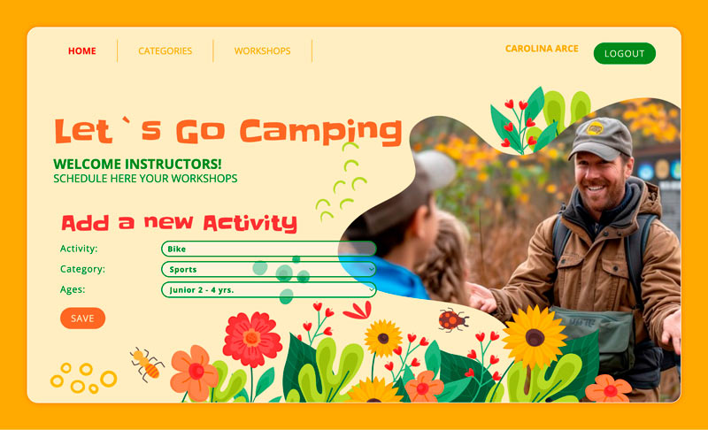
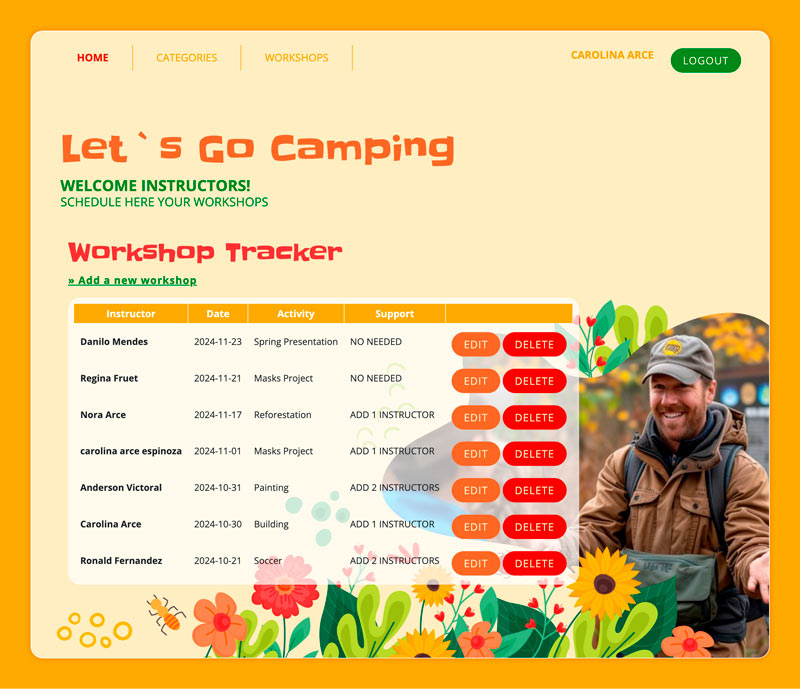

# Frameworks Local and Google Authentication

This project is an Express.js application with Google OAuth 2.0 integration for user authentication. It demonstrates a full-featured application that includes basic CRUD operations and user access control. Deployed on Vercel, the project uses MongoDB Atlas as its database.



---
## Project Overview
This application includes routes to handle user registration and authentication using Google OAuth, and routes for managing categories and workshops. All user data is stored in MongoDB Atlas, and sessions are managed using express-session.  




## Routes Overview
- Authentication Routes
        - GET /auth/google: Initiates Google OAuth authentication.  
        - GET /auth/google/callback: Callback URL for Google OAuth to process authentication and redirect users after login.  
        - GET /logout: Logs out the current user and terminates the session.

  

## CRUD Routes
- Categories Routes
        - GET /categories: Fetches a list of all categories.  
        - POST /categories: Creates a new category (requires user authentication).  
        - GET /categories/:id: Fetches details of a specific category by ID.  
        - PUT /categories/:id: Updates an existing category by ID (requires user authentication).  

  




- Workshops Routes
        - GET /workshops: Fetches a list of all workshops.  
        - POST /workshops: Creates a new workshop (requires user authentication).  
        - GET /workshops/:id: Fetches details of a specific workshop by ID.  
        - PUT /workshops/:id: Updates an existing workshop by ID (requires user authentication).  
        - DELETE /workshops/:id: Deletes a workshop by ID (requires user authentication).    


 

## Access Control
Access control is handled via session-based authentication with Google OAuth. When a user logs in, a session is created and stored in the database, allowing access to protected routes based on their authentication status.

- Authenticated Routes: CRUD operations that modify data (like POST, PUT, and DELETE requests) are restricted to authenticated users only.  
- Session Management: express-session is used to manage sessions. Each user session is uniquely identified and allows the user to remain logged in as they navigate the application.  
- Role-based Control: While this project currently supports authenticated users for protected routes, it can be extended to enforce specific roles and permissions for advanced access control.    

 

## Deployment
The project is deployed on Vercel, which serves the application as a serverless function. Ensure your .env variables are also set up in Vercel for a seamless deployment.

[Click here for the live website](https://frameworks-local-authentication.vercel.app/)


## Setup Instructions

### 1. Clone the repository
```bash
git clone <repository-url>
cd <project-folder>
```

### 2. Install dependencies
```bash
npm install
```

### 3. Configure environment variables
Create a .env file in the root directory of your project with the following variables:

```bash
GOOGLE_CLIENT_ID=your-google-client-id
GOOGLE_CLIENT_SECRET=your-google-client-secret
MONGO_URI=your-mongodb-uri
SESSION_SECRET=your-session-secret
```

- Note: Replace your-google-client-id, your-google-client-secret, your-mongodb-uri, and your-session-secret with actual values for your Google OAuth credentials, MongoDB URI, and a secure session secret.

### 4. Run the application locally
```bash
npm start
```

The application should now be running on http://localhost:3000.
Images Copyright Freepik Company S.L. All rights reserved.
